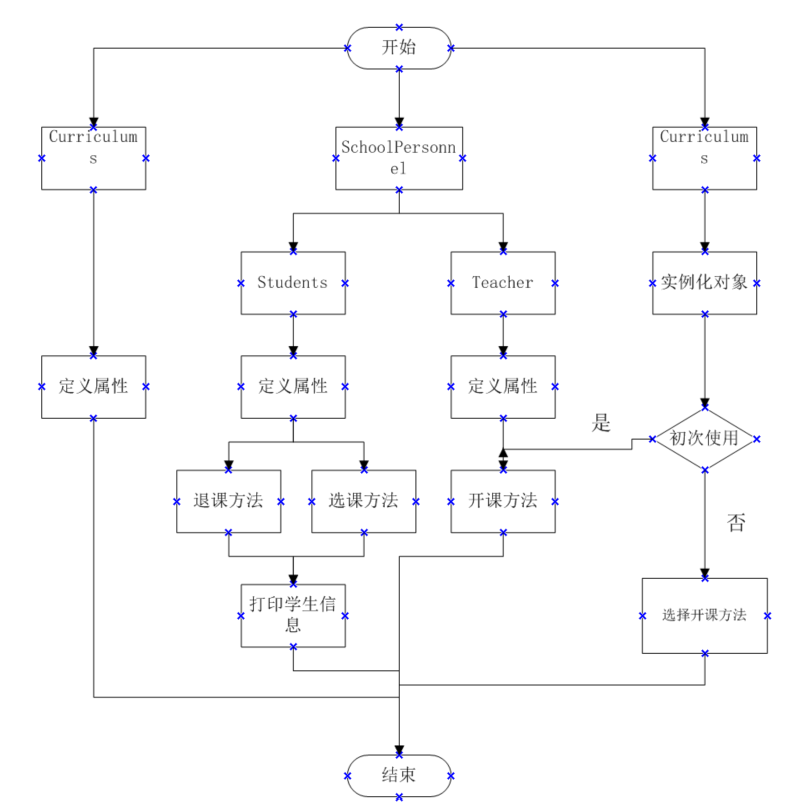

# 实验二 学生选课模拟系统

#### 一、实验目的

初步了解分析系统需求，从学生选课角度了解系统中的实体及其关系，学会定义类中的属性以及方法；
掌握面向对象的类设计方法（属性、方法）；
掌握通过构造方法实例化对象；
学会使用数组。


#### 二、实验要求

学校人员分为“教师”和“学生”，教师教授“课程”，学生选择“课程”。每名教师可讲授多门课程，每名学生可选修多门课程。多门课程，可用课程数组形式表达。
对象：教师（编号、姓名、性别、所授课程）学生（编号、姓名、性别、所选课程）课程（编号、课程名称、上课地点、时间、任课教师）。

1.编写上述实体类以及测试主类。

2.在测试主类中，实例化多个类实体，模拟：

教师开设某课操作；
学生选课操作、退课操作；
打印学生课表信息（包括：编号、课程名称、上课地点、时间、授课教师）。

3.编写实验报告。

#### 三、解题思路

1.根据题目要求定义Teachers，Students以及Curriculums类，并为其分别定义相关属性。

2.为Teachers类创建开课方法，即对Teachers类的课程属性进行增改，因为Teacher类的课程属性为数组，因此需要用new语句先创建空的数组作为初始值，再进行课程修改。

3.为Stdudents类创建选课以及退课方法，也即对Stdudents类的课程属性进行增改,同样因为其为数组类型，与Teachers类操作基本一致。

4.基本类以及属性方法已定义完成下面进行测试类编写。

5.根据题意，创建测试类并进行测试，为了更好的进行老师以及学生对象的操作，导入java.util.Scanner包进行键入操作，让操作有基本交互性。并将整个选课系统代码放入while循环，通过if语句以及键入操作控制，以此做到重复开课/选课/退课。

6.通过Curriculums类构造方法创建多个课程对象，并将其放入默认数组，在进行开课/选课操作时对该数组元素进行选取，提高效率。

7.在学生对象选课/退课完毕后，进行课表打印操作，并结束。


#### 四、关键代码

1.创建课程教师学生实例对象

```
        Curriculums gaoshu = new Curriculums(1, "gaoshu", "jiao103", "8:00");
        Curriculums wuli = new Curriculums(2, "wuli", "jiao300", "13:00");
        Curriculums dianlu = new Curriculums(3, "dianlu", "jiao201", "14:00");
        Curriculums xiandai = new Curriculums(4, "xiandai", "jiao202", "15:00");
        Curriculums lisan = new Curriculums(5, "lisan", "jiao203", "16:00");
        Curriculums wulishiyan = new Curriculums(6, "wulishiyan", "jiao204", "17:00");
        Curriculums moren1[] = new Curriculums[6];
        Curriculums moren2[] = new Curriculums[6];
        Teachers MrChen = new Teachers(1, "MrChen", "男", moren1); 
        Students StdChen = new Students(1, "StdChen", "男", moren2); 
```

2.教师开设课程操作(当程序第一次运行时默认为开课操作，后续循环可任意选择)

```
        public void openCurriculums(Teachers teacher, int n, Curriculums curriculums1) { // 开课方法
        teacher.curriculums[n] = curriculums1;
        System.out.println(teacher.name + "开设" + teacher.curriculums[n].curriculumsname + "课程成功");
    }
```

初次开课操作


```
         System.out.println("欢迎使用学生选课系统" + "\n" + "还未有教师开设课程，本次默认为开课操作" + "\n" + "正在进行开课操作!");
         System.out.println("可开课程为:" + "\n" + gaoshu.curriculumsname + "\n" + wuli.curriculumsname + "\n"
                 + dianlu.curriculumsname + "\n" + xiandai.curriculumsname + "\n" + lisan.curriculumsname + "\n"
                 + wulishiyan.curriculumsname + "以上次序依次为0~5");
         System.out.println("请输入所开设课程");
         int z = input.nextInt();
         Curriculums moren[] = { gaoshu, wuli, dianlu, xiandai, lisan, wulishiyan };
         MrChen.openCurriculums(Mrwang, z, moren[z]);
         moren[z].curriculumsTeacher = "MrChen";
         System.out.println("是否继续进行操作?" + "\n" + "1.继续" + "\n" + "2.结束");
```


后续开课操作

```
         System.out.println("正在进行开课操作!");
         System.out.println("可开课程为:" + "\n" + gaoshu.curriculumsname + "\n" + wuli.curriculumsname + "\n"
                 + dianlu.curriculumsname + "\n" + xiandai.curriculumsname + "\n" + lisan.curriculumsname
                 + "\n" + wulishiyan.curriculumsname + "以上次序依次为0~5");
         System.out.println("请输入所开设课程");
         int z = input.nextInt();
         Curriculums moren[] = { gaoshu, wuli, dianlu, xiandai, lisan, wulishiyan };
         MrChen.openCurriculums(MrChen, z, moren[z]);
         moren[z].curriculumsTeacher = "MrChen";
```

3.学生选课、退课及打印操作


```
    public void choiceCurriculums(Students student, int n, Curriculums curriculums1) { // 选课方法
        student.curriculums[n] = curriculums1;
        System.out.println(student.name + "选择" + student.curriculums[n].curriculumsname + "课程成功");
    }

    public void outCurriculums(Students student, int n) { // 退课方法
        System.out.println(student.name + "退选" + student.curriculums[n].curriculumsname + "课程成功");
        student.curriculums[n] = null;
    }
```


```
                int s = input.nextInt();
                    if (s == 1) { // 学生选课操作
                        System.out.println("正在进行选课操作!");
                        System.out.println("可开课程为:" + "\n" + gaoshu.curriculumsname + "\n" + wuli.curriculumsname + "\n"
                                + dianlu.curriculumsname + "\n" + xiandai.curriculumsname + "\n" + lisan.curriculumsname
                                + "\n" + wulishiyan.curriculumsname + "以上次序依次为0~5");
                        Curriculums moren[] = { gaoshu, wuli, dianlu, xiandai, lisan, wulishiyan };
                        int j = input.nextInt();
                        StdChen.choiceCurriculums(StdWang, j, moren[j]);
                    } else if (s == 2) { // 学生退课操作
                        System.out.println("正在进行退课操作!");
                        int p = input.nextInt();
                        StdChen.outCurriculums(StdWang, p);
                    } else {
                        TS.reportError();
                        break;
                    }
                    System.out.println("本次选课已结束，正在打印学生选课信息"); // 课表打印
                    System.out.println("学生姓名:" + StdWang.name + "\n" + "所选课程:" + "\n");
                    for (int i = 0; i < 6; i++) {
                        if (StdChen.curriculums[i] == null) {
                            continue;
                        }
                        System.out.print(StdWang.curriculums[i].number + "丨" + StdChen.curriculums[i].curriculumsname
                                + "丨" + StdChen.curriculums[i].place + "丨" + StdChen.curriculums[i].Classtime + "丨"
                                + StdChen.curriculums[i].curriculumsTeacher + "\n");
                    }
```


 #### 五、流程图


#### 六、程序运行截图


#### 七、感想与体会
通过本次实验提高了分析系统需求，从而进行程序设计的能力；理清了学生选课过程业务逻辑关系；熟练掌握定义以及调用类中的属性以及方法，面向对象的类设计方法（属性、方法）；学会使用数组等。我认为要通过题目来分析出程序需要设计几个类，每个类中需要什么属性，然后通过创建构造方法以及设置参数的形式来将课程、教师或者学生的信息录入。在实验中也遇到了很多问题，但是都在询问同学、自己的调整下解决了，提高了很多自己的能力。最后我希望能更多了解到java的编程知识，让我的程序设计能够变得更丰富更多样化。